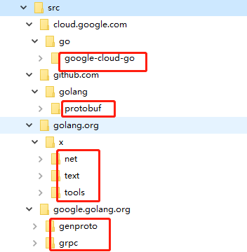
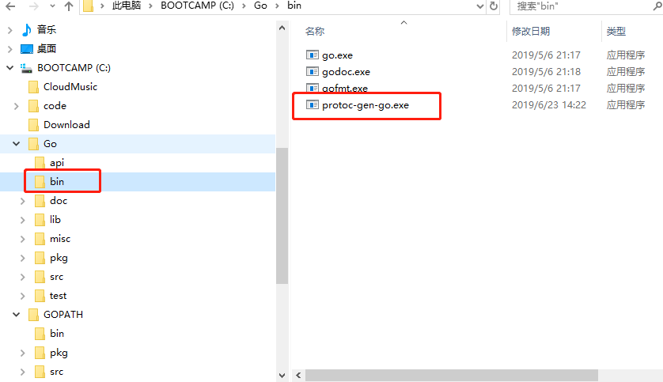

- #### 参考
    - [Protocol Buffer技术详解(语言规范)](https://www.cnblogs.com/stephen-liu74/archive/2013/01/02/2841485.html)
    - [protobuffer、gRPC、restful gRPC的相互转化(复杂类demo)](https://www.cnblogs.com/sevenyuan/p/8535382.html)
    - [protobuf官网](https://github.com/protocolbuffers/protobuf/releases)
- #### grpc安装
    - 参考
        - [Windows环境下gRPC安装](https://www.colabug.com/6466948.html)
        - [golang安装gRpc](https://www.jianshu.com/p/dba4c7a6d608)
    - 步骤
        * 安装protobuf
            - 参考[protobuf官网](https://github.com/protocolbuffers/protobuf/releases)
            - 将bin设置环境变量
        * 安装grpc:$GOPATH/src路径下有三个文件夹 github.com + golang.org + google.golang.org
            1. github.com文件夹添加子文件夹golang，进入golang文件夹
                - go get -u github.com/golang/protobuf/proto
                - go clone https://github.com/golang/protobuf.git(二选一)
            2. golang.org文件夹添加x文件夹，进入x文件夹
                - git clone https://github.com/golang/text.git
                - git clone https://github.com/golang/net.git
                - git clone https://github.com/golang/tools.git(三个都执行)
            3. google.golang.org文件夹
                - git clone https://github.com/grpc/grpc-go
                - git clone https://github.com/google/go-genproto(都执行)
                - 将grpc-go的文件夹名称修改为grpc	
                - 将go-genproto的文件夹名称修改为genproto
            4. 进入$GOPATH/src文件夹
                - go install ./google.golang.org/grpc
            5. 最终文件夹格式:
                 
        * 安装grpc-gateway
            1. go get -u github.com/grpc-ecosystem/grpc-gateway(clone到github.com)
            2. 参考命令 protoc-gen-grpc-gateway: Plugin failed with status code 1.
            3. protoc -IC:\code\mygrpc\proto\helloworld -I. -IC:\GOPATH/src -IC:\GOPATH\src\github.com\grpc-ecosystem\grpc-gateway\third_party\googleapis --go_out=plugins=grpc:. C:\code\mygrpc\proto\helloworld\helloworld.proto
-  问题
    - 1. 'protoc-gen-go' 不是内部或外部命令，也不是可运行的程序
        - 参考:[golang使用protobuf简易教程](https://blog.csdn.net/qq_15437667/article/details/78425151)
        - 找到protoc-gen-go文件夹执行下列命令，我的路径为：C:\GOPATH\src\github.com\golang\protobuf
            - 命令 get install ./protoc-gen-go会生成会在$GOPATH/bin下生成exe文件
            - 将 $GOPATH/bin/protoc-gen-go.exe文件copy到$GOROOT/bin(已设置到环境变量中)下
        - 文件夹格式
             
    - 2. go: cloud.google.com/go@v0.26.0: unrecognized import path "cloud.google.com/go" 
        - 参考：[unrecognized import path (golang google package)
](https://stackoverflow.com/questions/47000312/unrecognized-import-path-golang-google-package)   
        - git clone https://github.com/GoogleCloudPlatform/google-cloud-go
        - mv google-cloud-go $GOPATH/src/cloud.google.com/go/
        - set GOPROXY=https://goproxy.io   
    - 3. undefined: proto.ProtoPackageIsVersion3
        - 参考[通过envoy实现http/json到grpc的转码
](https://blog.csdn.net/jinyidong/article/details/87921593) 
        - set GO111MODULE=on
        - go get github.com/golang/protobuf@master    
  